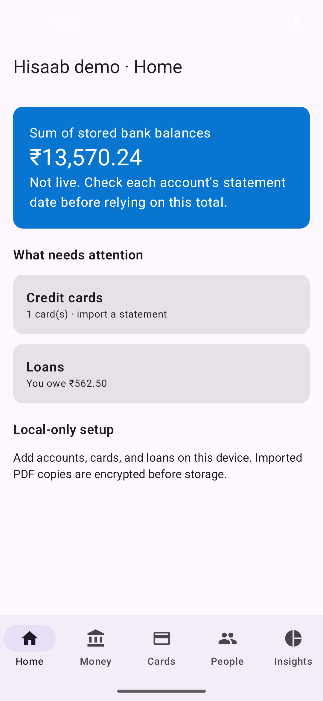
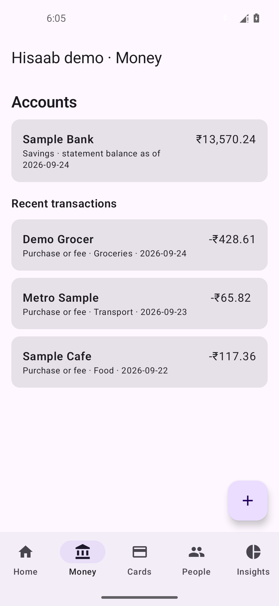
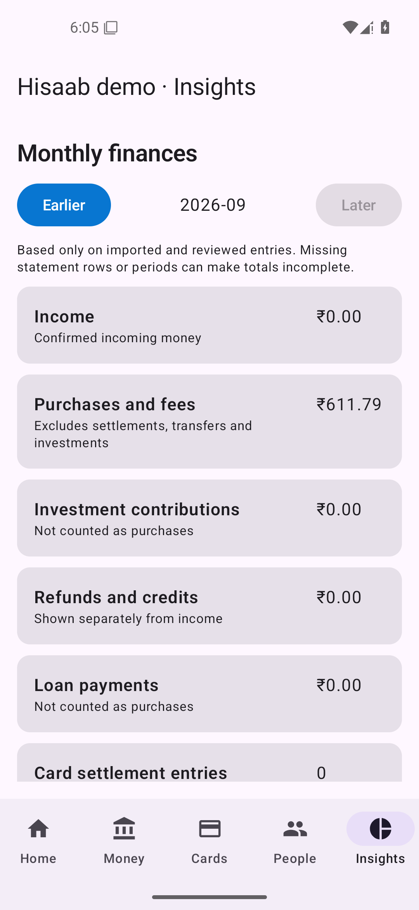

# Hisaab

Hisaab is a private Android money overview built around statements you choose to import. It works on-device: no account sign-up, bank connection, or network permission is required.

## Download and install

Download **[Hisaab.apk](./Hisaab.apk)** from this page. On GitHub, open the APK and choose **Download raw file** (or use the file's three-dot menu). Open the downloaded file on your Android phone and confirm Android's installation prompt. If Android asks to allow this browser or file manager to install apps, enable it only for this installation and turn it off afterward. Install only the signed release APK from this repository, not a debug build. If Android reports an unexpected signer or asks for permissions beyond local files and device authentication, stop and review the build.

The APK is built from this repository, signed with a private key that is **not** committed here, and checked for a non-debuggable manifest and forbidden permissions. The source and build instructions are in [`.github/project`](./.github/project); GitHub Actions must remain in [`.github/workflows`](./.github/workflows), which is why the one visible folder at the root is `.github`.

For this APK, SHA-256 is `95d676e96b396ec16b1f784af5da49b39003cf8626626f5a16dfcd6c6349e8e3`. The signing certificate SHA-256 is `889aceb4f478bbfd13119788955ff0d4f2e584723d06c8415e15a7ec82cf523b`.

## See the app

These are actual Android emulator captures of the debug-only Hisaab demo. Every account, contact, transaction, and amount shown is invented. The release APK has no demo fixture, and no personal statement or financial record is used to produce these images.

| Home | Money | Insights |
| --- | --- | --- |
|  |  |  |

## What works now

- Add bank accounts, cards, and private loans manually.
- Import supported PDF statements through Android's file picker. Current parsers cover text-based ICICI savings and credit-card statements and an offline OCR path for image-based HDFC savings statements. Other statement formats may not parse yet.
- Keep the vault and imported PDF copies encrypted in the app's internal storage. Entered PDF passwords are used for import and are not saved.
- Review statement-import row counts and transactions that need classification; save local matching rules.
- View monthly income, purchases, investments, refunds, transfers, and card settlements separately. Account balances are **last known statement values**, not live bank balances. Card amount due is not shown unless it can be reconciled.
- Lock access behind the phone's secure screen lock or biometrics. The release app declares no internet, SMS, contacts, or account permission.

There is no automatic bank sync, email or SMS reading, cloud backup, or live-balance connection. A missing statement period or unparsed row can make insights incomplete. Do not use Hisaab as the sole record for a payment decision.

## What comes next

Reliability comes first: broader statement coverage, balance reconciliation, missing-period warnings, and a clear queue for uncertain transactions. After that, category budgets, recurring-payment reminders, and goal tracking would help turn the ledger into decisions. These are planned, not present in the APK.

This direction was informed by established products: [Wallet](https://budgetbakers.com/en/products/wallet/features/) uses category budgets and spending insights; [YNAB](https://www.ynab.com/features) emphasizes targets and spending/net-worth reports; [Monarch](https://www.monarch.com/features/tracking) offers drill-down reporting and recurring-payment views; [Money Manager](https://www.realbyteapps.com/) uses category budgets and asset charts. Hisaab's distinguishing constraint is to keep statement processing local and make confidence in each number visible before adding more dashboard features.

## Repository layout and privacy

The root intentionally has only `.github/`, this `README.md`, and the signed `Hisaab.apk`. Android source, tests, technical notes, and screenshot assets live inside `.github/project/`. The release key, statement files, passwords, personal screenshots, and on-device vault must never be committed. Before publishing, run `.github/project/scripts/verify_repository_privacy.ps1` and review the branch diff manually. The check is a guardrail, not proof that arbitrary binary content is safe.

The same private signing key must be retained to publish installable updates. Losing it can make an existing installation impossible to update in place. Device backup is currently disabled; there is no recovery mechanism for the local vault if the phone is lost.
